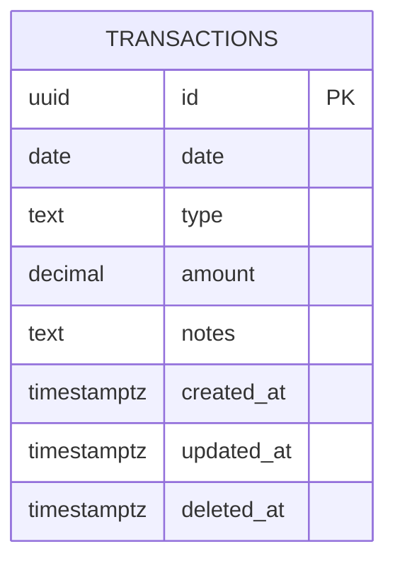

# Gastos - Personal Finance Tracker

A web app to replace your Excel-based expense tracking with a modern, mobile-friendly interface. Built with Next.js, Supabase, and shadcn/ui.

## User Review Required

> [!IMPORTANT] > **Single User App** - Schema designed for you only. No multi-tenancy overhead.

> [!NOTE] > **Types are local config** - Adding new expense/income types requires code change, not DB migration. This is intentional for simplicity.

---

## Proposed Changes

### Phase 1: Foundation

#### [NEW] lib/supabase/client.ts

Supabase client configuration for browser and server.

#### [NEW] lib/supabase/middleware.ts

Auth middleware for protected routes.

#### [NEW] lib/data/types.ts

Local type definitions with categories, icons, and colors:

```typescript
export const transactionTypes = {
  // Expenses
  school: {
    label: "School",
    category: "expense",
    group: "school",
    icon: "GraduationCap",
    color: "#ef4444",
  },
  tuition: {
    label: "Tuition",
    category: "expense",
    group: "school",
    icon: "School",
    color: "#ef4444",
  },
  groceries: {
    label: "Groceries",
    category: "expense",
    group: "groceries",
    icon: "ShoppingCart",
    color: "#f97316",
  },
  food: {
    label: "Food",
    category: "expense",
    group: "groceries",
    icon: "Utensils",
    color: "#f97316",
  },
  personal: {
    label: "Personal",
    category: "expense",
    group: "personal",
    icon: "User",
    color: "#8b5cf6",
  },
  general: {
    label: "General",
    category: "expense",
    group: "general",
    icon: "Package",
    color: "#6b7280",
  },
  other_expense: {
    label: "Other",
    category: "expense",
    group: "other",
    icon: "MoreHorizontal",
    color: "#6b7280",
  },

  // Income
  allowance: {
    label: "Allowance",
    category: "income",
    group: "allowance",
    icon: "Wallet",
    color: "#22c55e",
  },
  scholarship: {
    label: "Scholarship",
    category: "income",
    group: "scholarships",
    icon: "Award",
    color: "#3b82f6",
  },
  other_income: {
    label: "Other Income",
    category: "income",
    group: "other",
    icon: "Plus",
    color: "#22c55e",
  },
} as const;

export const expenseGroups = [
  "school",
  "groceries",
  "personal",
  "general",
  "other",
] as const;
export const incomeGroups = ["allowance", "scholarships", "other"] as const;
```

#### [NEW] Database Schema (Supabase)

```sql
-- Transactions table
create table transactions (
  id uuid primary key default gen_random_uuid(),
  date date not null default current_date,
  type text not null,
  amount decimal(12,2) not null,
  notes text,
  created_at timestamptz default now(),
  updated_at timestamptz default now(),
  deleted_at timestamptz -- soft delete
);

-- Indexes for performance
create index idx_transactions_date on transactions(date desc);
create index idx_transactions_type on transactions(type);
create index idx_transactions_deleted on transactions(deleted_at) where deleted_at is null;

-- RLS Policy (only authenticated user)
alter table transactions enable row level security;
create policy "Authenticated access" on transactions
  for all using (auth.role() = 'authenticated');
```

#### [MODIFY] app/layout.tsx

Add Supabase provider and auth context.

#### [NEW] app/login/page.tsx

GitHub OAuth login page with redirect.

#### [NEW] app/(protected)/layout.tsx

Protected layout wrapper checking auth state.

---

### Phase 2: Core Features

#### [NEW] app/(protected)/dashboard/page.tsx

Split-view dashboard:

- Left: Quick Add Form
- Right: Monthly Summary Cards + Mini Chart
- Bottom: Recent Transactions (limited to ~10)

#### [NEW] components/transactions/quick-add-form.tsx

Transaction entry form with:

- Date picker (defaults today)
- Type dropdown (grouped by category)
- Amount input with inline calc support (`100+50` → `150`)
- Notes field
- Submit creates transaction

#### [NEW] lib/utils/calculate.ts

Safe math expression parser for inline calculations.

```typescript
export function parseAmount(input: string): number | null {
  // Supports: 100+50, 500*0.8, 1000-200, 100/4
  // Returns null if invalid
}
```

#### [NEW] app/(protected)/transactions/page.tsx

Full transaction list with:

- Infinite scroll
- Search by notes
- Filter by type/category
- Filter by date range (month/year picker)
- Sort: newest first
- Batch select for bulk delete

#### [NEW] components/transactions/transaction-list.tsx

Reusable transaction list component.

#### [NEW] components/transactions/transaction-row.tsx

Individual transaction row with:

- Type icon + color
- Date, amount, notes
- Edit/Delete actions
- Checkbox for batch select

#### [NEW] lib/actions/transactions.ts

Server actions for CRUD:

- `createTransaction()`
- `updateTransaction()`
- `softDeleteTransaction()` / `softDeleteBatch()`
- `restoreTransaction()`
- `getTransactions()` with pagination/filters

#### [NEW] lib/queries/transactions.ts

Query functions for data fetching.

---

### Phase 3: Summary & Analytics

#### [NEW] app/(protected)/summary/page.tsx

Excel-style monthly summary view:

- Year dropdown selector
- Rows: Months (Jan-Dec + Total)
- Columns: Expense groups | Revenue groups | Savings
- Color-coded headers (red/blue/green)

#### [NEW] components/summary/monthly-table.tsx

The aggregated summary table component.

#### [NEW] app/(protected)/charts/page.tsx

Analytics dashboard with:

- Monthly totals bar chart (income vs expenses)
- Category breakdown pie chart
- Expense trends line chart
- Top spending categories ranked list
- Period comparison cards (MoM, YoY)
- Weekly spending summary
- Custom date range picker

#### [NEW] components/charts/\*.tsx

Chart components using Recharts:

- `MonthlyBarChart`
- `CategoryPieChart`
- `TrendLineChart`
- `ComparisonCards`

#### [NEW] lib/queries/analytics.ts

Aggregation queries for charts and summaries.

---

### Phase 4: Polish & Import

#### [NEW] app/(protected)/import/page.tsx

Data import page:

- CSV/Excel file upload
- Column mapping UI
- Preview before import
- Batch insert

#### [NEW] lib/utils/import-parser.ts

Parse CSV/Excel files and map to schema.

#### [NEW] next.config.ts updates

PWA configuration with next-pwa.

#### [NEW] public/manifest.json

PWA manifest for mobile install.

---

## Database Schema Diagram



---

## Page Structure

```
app/
├── login/page.tsx           # GitHub OAuth
├── (protected)/
│   ├── layout.tsx           # Auth guard
│   ├── dashboard/page.tsx   # Main view
│   ├── transactions/page.tsx # Full list
│   ├── summary/page.tsx     # Excel-style view
│   ├── charts/page.tsx      # Analytics
│   └── import/page.tsx      # Data import
```

---

## Verification Plan

### Automated Tests

- Unit tests for `parseAmount()` calculator utility
- Integration tests for transaction CRUD actions

### Manual Verification

- Test GitHub OAuth flow
- Verify transaction CRUD operations
- Check infinite scroll pagination
- Validate summary calculations match manual totals
- Test on mobile viewport sizes
- Import sample Excel data

---

## Implementation Order

| Phase | Focus                 | Est. Effort  |
| ----- | --------------------- | ------------ |
| **1** | Auth + Schema + Types | 1-2 sessions |
| **2** | Dashboard + CRUD      | 2-3 sessions |
| **3** | Summary + Charts      | 2-3 sessions |
| **4** | Import + PWA          | 1-2 sessions |

> [!TIP]
> We can start with Phase 1 immediately. Each phase is independently deployable.
